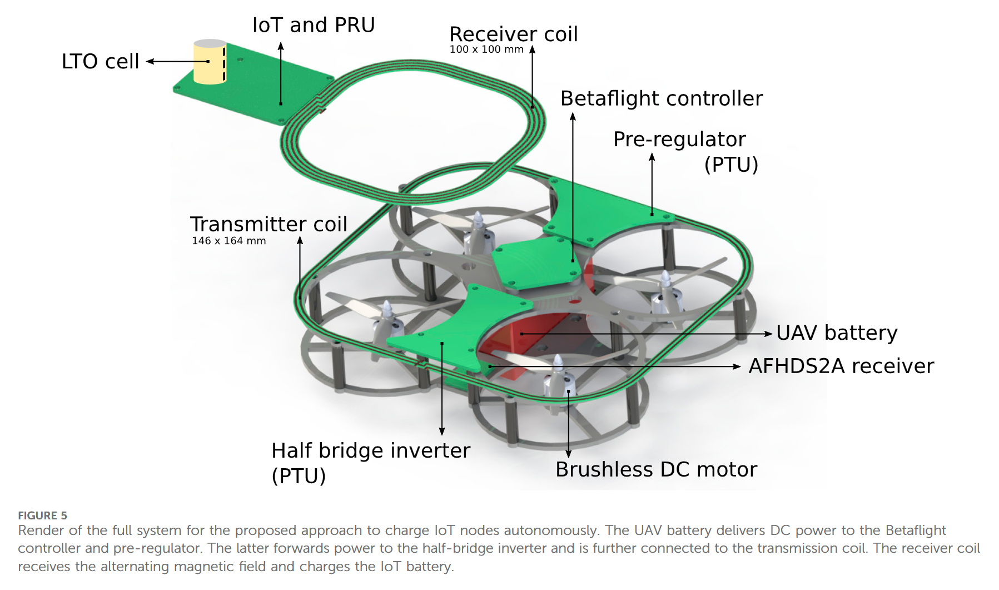
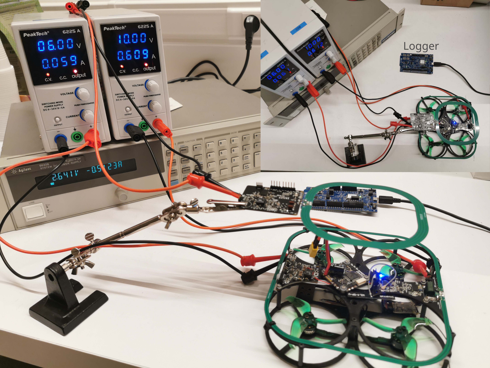

# UAV Charging Demo

Hardware demo based on [UAV-Based Charging Solution](https://github.com/jarnevanmulders/UAV-Based-Charging-Solution).

### Hardware Modules
- **`RX/`** — Receiver (IoT & PRU)
- **`TX/Inverter/`** — Half-bridge inverter (PTU)
- **`TX/Pre-regulator/`** — Pre-regulator (PTU)

---

### System Overview

### Experimental Setup

